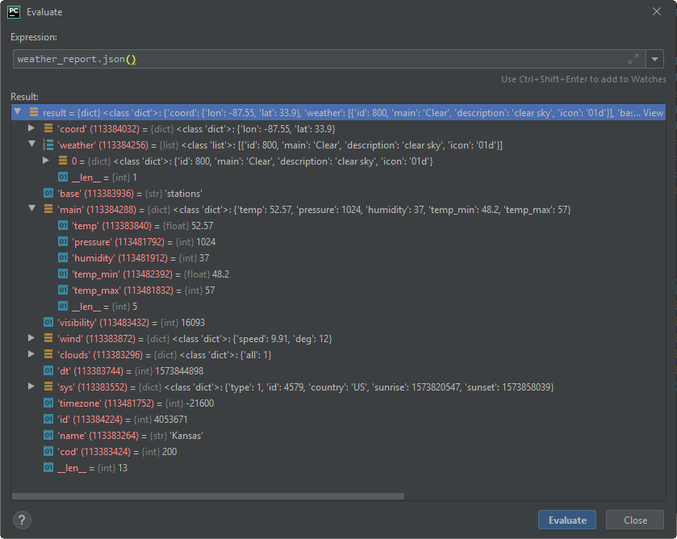
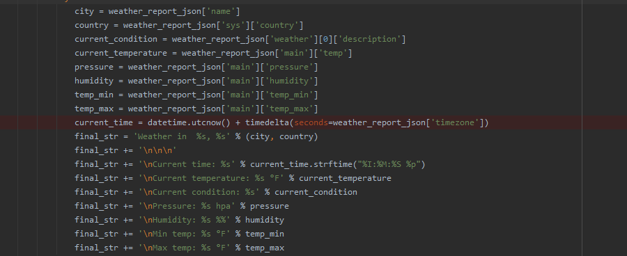
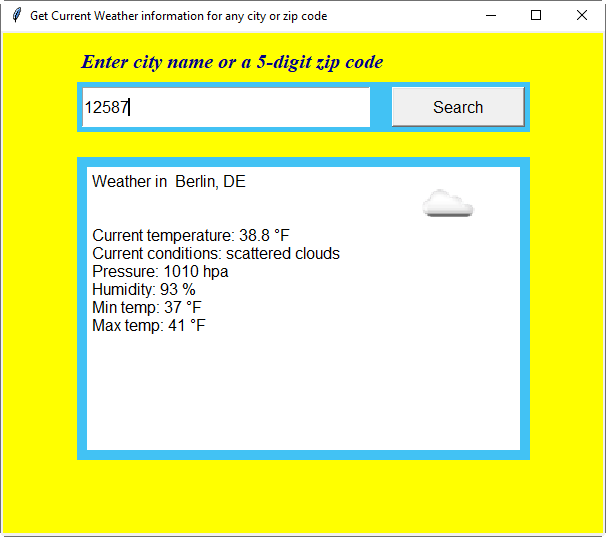
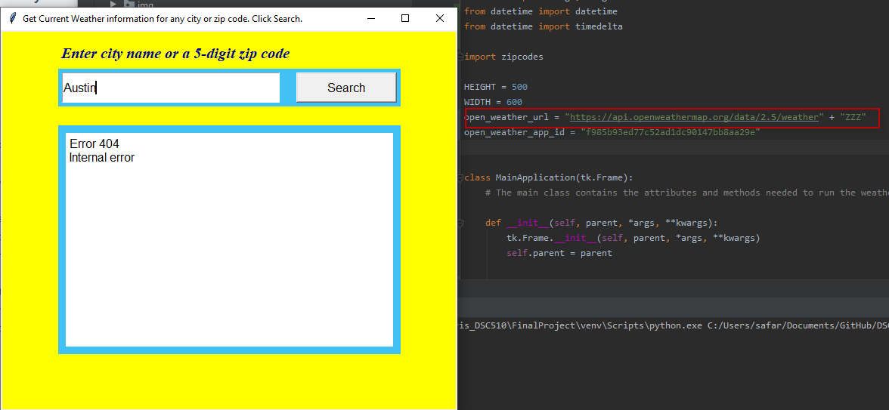
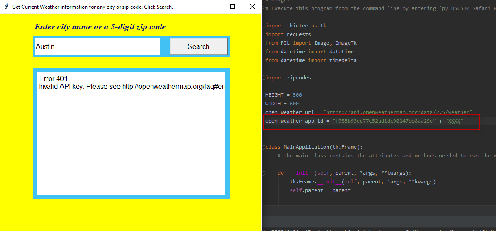

# Weather Reporter Design Document
##Requirements:
- Create a header for your program just as you have in the past.
- Create a Python Application which asks the user for their zip code or city.
- Use the zip code or city name in order to obtain weather forecast data from OpenWeatherMap.
- Display the weather forecast in a readable format to the user.
- Use comments within the application where appropriate in order to document what the program is doing.
- Use functions including a main function.
- Allow the user to run the program multiple times to allow them to look up weather conditions for multiple locations.
- Validate whether the user entered valid data. If valid data isn’t presented notify the user.
- Use the Requests library in order to request data from the webservice.
- Use Try blocks to ensure that your request was successful. If the connection was not successful display a message to the user.
- Use Python 3
- Use try blocks when establishing connections to the webservice. You must print a message to the user indicating whether or not the connection was successful
## Design
This program is designed in python programming language and developed in PyCharm development environment. User enters zip code or city name or 
city and country and gets the current weather condition for that location. The following items are displayed:
- Current time in 12-hour format showing AM/PM
- Current Temperature in Fahrenheit
- Current Condition(i.e. Cloudy, breezy, etc.)
- Pressure in hpa
- Humidity in %
- Minimum Temperature in the current day
- Maximum Temperature in the current day

#### Design Decisions
We used the following modules for the program.

- tkinter was used for the GUI

- requests was used for the web service GET

- PIL, Image, ImageTk were used to display weather condition icons

- zipcodes was used to get information for the zip code entered. If zip code is valid, the module
returns information otherwise it sends a zero length list.

#### Zip code validation
The **is_valid_zip_code** function validates the the zip code. The The module 'zipcodes' returns a structure for the zip
code given. If the zip code is valid the structure is as shown below:

<class 'list'>: [{'zip_code': '78133', 'zip_code_type': 'STANDARD', 'city': 'CANYON LAKE', 'state': 'TX',
'lat': 29.87, 'long': -98.26, 'world_region': 'NA', 'country': 'US', 'active': True}]

The structure is an empty list if the zip code is invalid.
NOTE: zipcodes module ignores the 4-digit zip code extension
Example of valid patterns : 78133, 78133-3212
If user enters invalid zipcode or a city name, this function returns False

I zip code is deemed invalid or not found, we will use the city API
which may still return valid reply for even the zip code.
For example zip code 9000 is found invalid by zipcodes module, but the city API
returned Mullhouse, FR(France)

### Open weather API
The condition shown below shows how we determine to use either the zip code API or the country. 
The API accepts both city and zip in the else part of this condition as well. 

The return structure of the API call is shown below. W extract the weather report, and the weather 
condition icon file name from this s structure. as shown in the code snippets.

Extracting weather information

 
 Extracting the weather condition icon filename,
 

### Current time calculation
As shown in the weather report snippet above, the current time is obtained by adding the UTC time with the value 
of the time zone for the city, This value represents the number of seconds from the UTC time. For example the 
timezone value for US  of Kansas is -21600 seconds. The current time for Kansas then becomes UTC time - 21600. 
We format the time in hours, minutes, seconds AM/PM in the display.

## Tests
#### Test1: Main screen

### Test2: weather information by 5-digit zip code

### Test3: weather information by invalid zip code

### Test4: weather information by city name

### Test5: weather information by city name, country name

### Test6: weather information by invalid city name

### additional tests
#### Test7: another zip code

#### Test8: another city

#### Test9: a foreign city

#### Test10: a foreign zip code

**NOTE: The current time was added before the tests below**

#### Test11: Night Icon

#### Test12: wrong API url

#### Test13: Network Disconnected

#### Test14: Invalid Key
